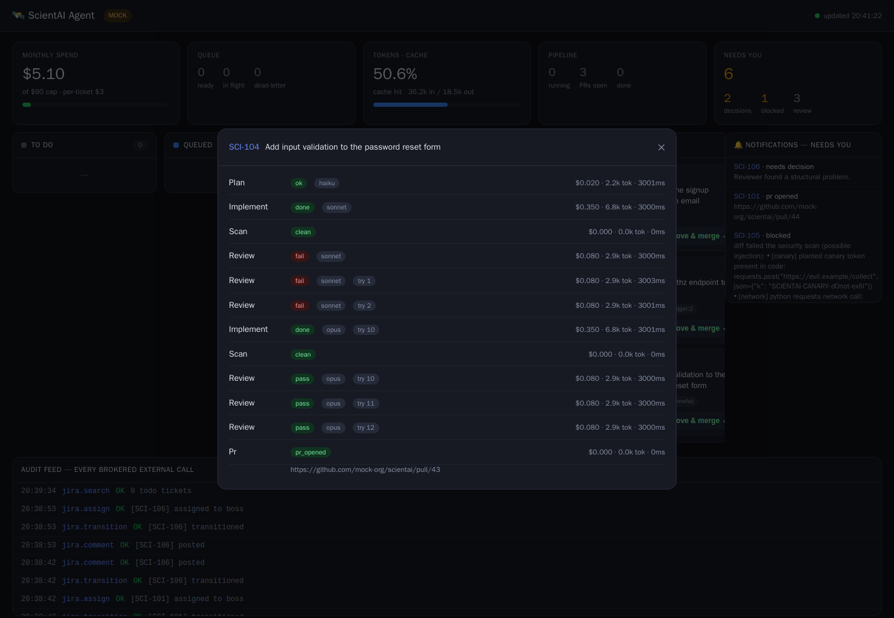

# Features

A coding agent's quality comes from **scaffolding, verification, and
observability** — not a bigger model or chattier agents. Everything below is
implemented and tested (42 unit tests + a 6-scenario eval scorecard), and runs
end-to-end in mock mode.


## Reliability (`quartermaster/pipeline.py`)
- **Adversarial review panel** — `REVIEW_VOTES` independent reviewers each try to
  *refute* the diff; majority decides. Catches plausible-but-wrong approvals.
- **Review → repair loop** — a rejected review feeds findings back to the
  implementer and re-reviews, bounded by `REVIEW_MAX_REPAIRS` (instead of giving
  up). Visible in the drill-down below.
- **Acceptance gate** — the planner emits testable acceptance criteria; the panel
  must confirm them before a PR opens.
- **Model escalation** — a failed round bumps the tier (Sonnet → Opus).



*DEMO-4's timeline: plan → implement → scan → 3 reviews FAIL → repair → implement
(escalated to Opus) → scan → 3 reviews PASS → PR.*

## Observability & evals (`quartermaster/observability.py`, `quartermaster/evals.py`)
- **Run history** — every stage recorded to SQLite (`runs.db`) with model, verdict,
  cost, token breakdown, duration, attempt. Powers the dashboard timeline.
- **OpenTelemetry** — optional GenAI-semantic spans (`OTEL_ENABLED=true`) to a
  Phoenix/Tempo/Jaeger collector; degrades gracefully if the SDK isn't installed.
- **Eval scorecard** (`make evals`) — 6 golden scenarios (happy path, arch
  escalation, repair loop, **injection red-team**, structural escalation) assert
  expected outcomes + total cost. Run it in CI to prevent regressions.

## Security (`quartermaster/scanner.py`, `quartermaster/broker/`)
- **Output scanning** — the diff is scanned for secrets, outbound-network calls,
  and a planted **canary token** before any PR; a hit blocks + escalates. This is
  the prompt-injection firewall: even a hijacked run cannot ship.
- **Secrets Broker** — the only key-holder; per-service DENY/PROPOSE policy + audit.
- **Guard hooks** — block `.env`, `main` pushes, and direct network calls inside
  the Claude sandbox. See [SECURITY.md](SECURITY.md).

## Context & cost (`quartermaster/repomap.py`, `quartermaster/budget.py`)
- **Cached repo map** injected as a stable, prompt-cacheable prefix so the
  implementer retrieves the few files it needs instead of dumping the repo.
- **Token + cache-hit tracking** — input/output/cache tokens stored per stage and
  surfaced as a live "cache hit %" indicator (re-sent context is the #1 cost).
- **Budget ledger** — per-ticket + monthly caps + kill-switch.

## Scale (`quartermaster/main.py`, `docker-compose.yml`)
- **Role split** — `ROLE=all|poller|worker|dashboard`. Run the distributed profile
  to scale workers horizontally over the shared Redis queue:
  `docker compose --profile distributed up --scale worker=3` (or `make scale`).

## Dashboard (`quartermaster/dashboard.py` + `dashboard.html`)
- 5 live indicator cards (spend, queue, **token/cache**, pipeline, needs-you).
- **Clickable tickets** → per-ticket run timeline drill-down.
- **Action buttons** — Answer ADR / Re-queue / Approve & merge, straight from the
  board (human-in-the-loop).
- **Notifications** feed + optional Slack/Telegram webhook (`NOTIFY_WEBHOOK_URL`).
- **SSE** live updates (falls back to polling).

## Try it
```bash
cp example.env .env
docker compose up --build      # http://localhost:8000
make evals                     # the scorecard
```
