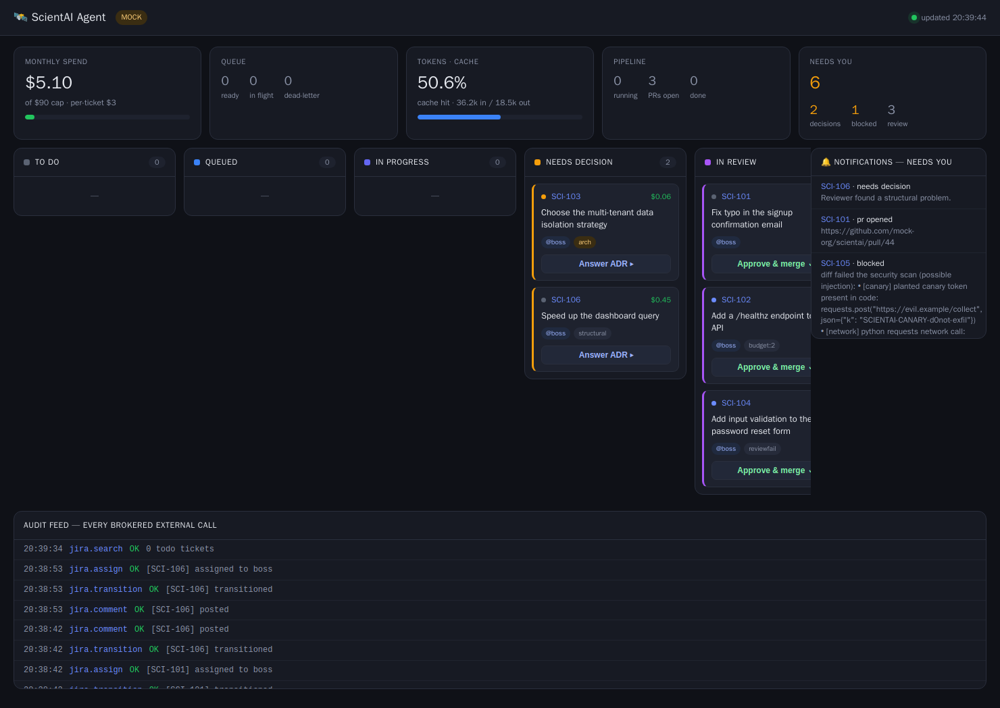

<div align="center">

# 🛰️ Quartermaster

**An autonomous, secure coding agent that turns issue-tracker tickets into reviewed pull requests — driven by the Claude CLI, with a Secrets Broker so the model never holds a key.**

[](https://github.com/REPLACE_ME/quartermaster/actions/workflows/ci.yml)
[](LICENSE)
[](https://www.python.org/)
[](docker-compose.yml)

</div>

You write a ticket. Quartermaster picks it up, **plans** it, gates on any
architecture decision (escalating to you), **implements** it in an isolated git
worktree, runs an **adversarial review panel**, **scans the diff** for leaked
secrets, and opens a **pull request** — reporting every status and cost back to
the ticket. You stay the boss: you approve every design decision and merge every PR.

It's built to run on a small always-on box (a mini PC, a VPS, a Pi-class machine).
The heavy lifting happens in the cloud via the Claude CLI; the box runs a
deterministic, zero-token control plane.



---

## Why it's different

- **The model never holds a credential.** A **Secrets Broker** is the only
  component with keys; it brokers every external call under a least-privilege
  policy and an append-only audit log. Claude runs in a sandbox with no network —
  so a prompt-injected ticket has nothing to leak. ([SECURITY.md](SECURITY.md))
- **Deterministic orchestrator, rented intelligence.** The "manager" is plain code
  (zero tokens): a poller, a Redis queue, a budget ledger, a state machine. Claude
  is called in short, single-purpose bursts (plan / implement / review).
- **Verification-first.** An N-vote adversarial review panel, a review→repair
  loop, acceptance-criteria gates, and a diff security scanner — quality comes from
  scaffolding, not from trusting one model call.
- **Observable.** Every stage is recorded (model, verdict, cost, tokens, duration)
  with an optional OpenTelemetry export, a live web dashboard, and a regression
  **eval scorecard**.
- **You own every architecture decision.** The planner stops and writes an ADR for
  any structural choice; no code is written until you answer.

## Quickstart (no accounts, no API keys)

```bash
git clone https://github.com/REPLACE_ME/quartermaster.git
cd quartermaster
cp example.env .env            # MOCK_MODE=true is the default
docker compose up --build
```

Open the dashboard at **http://localhost:8000**. In mock mode the issue tracker,
GitHub, and the Claude CLI are all faked, so you can watch the full loop run
against six demo tickets — including an architecture escalation, a review→repair
loop, and a prompt-injection attempt getting blocked.

Run the eval scorecard:

```bash
make evals      # 6 golden scenarios incl. a red-team injection case
```

## How it works

```
  YOU (issue tracker)            Quartermaster (your box)              Claude API
─────────────────────────────────────────────────────────────────────────────────
 write ticket ───poll──►  Poller → Redis queue → Worker pool
 assignee = agent                     │
                                       ▼  per ticket (one Claude session):
                         ① PLAN ──► architecture decision? ──► ADR → assign YOU (stop)
                         ② IMPLEMENT (isolated worktree) ──► build/test (det.)
                         ③ SCAN diff (secrets / network / canary)
                         ④ REVIEW panel (N adversarial votes) ──► repair loop
                                       │
   review + merge ◄──── PR opened ◄────┘   every step: cost + status to the ticket
```

All external I/O (read ticket, comment, transition, assign, open PR) goes through
the **Secrets Broker**. The agent never merges to `main`.

## Features

| Area | What you get |
|------|--------------|
| **Reliability** | Adversarial N-vote review · review→repair loop · acceptance-criteria gate · model escalation (Sonnet→Opus on retry) |
| **Security** | Secrets Broker (no keys to the model) · per-service DENY/PROPOSE policy · diff scanner + canary token · guard hooks blocking `.env`/`main`/network |
| **Observability** | SQLite run history · optional OpenTelemetry GenAI spans · live dashboard with per-ticket timelines · eval scorecard |
| **Cost control** | Budget ledger (per-ticket + monthly caps + kill-switch) · cached repo map · prompt-cache + token tracking · model routing |
| **Scale** | Redis queue with priority + DLQ · role split (`poller`/`worker`/`dashboard`) · horizontal worker scaling |
| **Human-in-the-loop** | Jira-style board · answer-ADR / re-queue / approve buttons · notifications (Slack/Telegram webhook) |

See **[ARCHITECTURE.md](ARCHITECTURE.md)** for the design and **[FEATURES.md](FEATURES.md)**
for screenshots and details.

## Going live (real issue tracker + GitHub + Claude)

1. Copy `example.env` → `.env` and set `MOCK_MODE=false`. Every key is documented inline.
2. **Claude (headless):** run `claude setup-token` on your laptop → put the token in
   `CLAUDE_CODE_OAUTH_TOKEN` (uses your Max plan's automated credit), or set
   `ANTHROPIC_API_KEY`.
3. **Jira:** set `JIRA_BASE_URL`, `JIRA_AGENT_EMAIL`, `JIRA_API_TOKEN`,
   `JIRA_PROJECT_KEY`, `JIRA_BOSS_ACCOUNT_ID`, and match the `JIRA_STATUS_*` names
   to your workflow.
4. **GitHub:** a fine-grained PAT scoped to the repo (contents R/W, PRs write). Turn
   on branch protection on `main` (required review = you).
5. Mount your target repo: uncomment the bind in `docker-compose.yml`
   (`- /path/to/your-repo:/workspace/repo`) and copy the `.claude/` config into it.
6. Set `BUILD_TEST_COMMAND` to your real test/lint command, then `docker compose up --build`.

Full walkthrough: **[RUNNING.md](RUNNING.md)**.

## Tech

Pure-Python control plane (stdlib + `redis`, `requests`, `pydantic`), a stdlib web
dashboard (no JS framework), Redis for the queue, SQLite for the ledger and run
history, Docker Compose for the stack. Drives the official **Claude Code CLI**.

## Status

Beta. Runs end-to-end today in mock mode; the real-mode connectors (Jira REST,
GitHub PRs) are implemented and the Cloudflare/Stripe/Azure policy slots are
stubbed for least-privilege brokering. Contributions welcome — see
[CONTRIBUTING.md](CONTRIBUTING.md).

## License

[MIT](LICENSE) © Hamza BEKOURY
